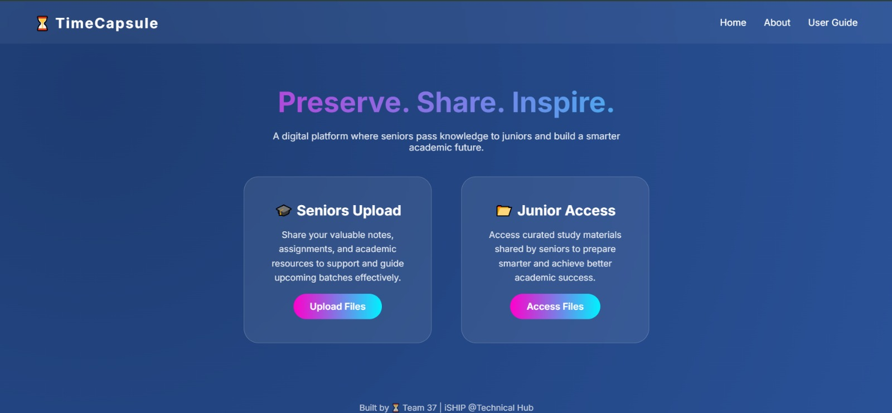

<p align="center">
  
</p>


# ⏳ TimeCapsule – Unlock the Past, Ace the Future

An academic knowledge-sharing platform developed under the **iSHIP Program @ Technical Hub** that automates senior document uploads, approval workflows, and junior access using Microsoft 365 tools.


## 🖥 Preview

### 🌐 Website Home Page



## 🎥 Project Demonstration

This demo video showcases:

- Senior Document Upload Flow  
- Automated Approval Workflow  
- Outlook Email Notifications  
- SharePoint Subject-wise Storage  
- Junior Access System  

▶ **[Watch Full Demo Video](Video%Demo/PC%View)**


## 📌 Project Overview

TimeCapsule is designed to preserve valuable academic resources from senior students and make them accessible to juniors through a structured and automated workflow system.
The platform ensures:

* ✅ Automated document approval
* ✅ Secure subject-wise storage
* ✅ Email notifications
* ✅ Controlled access for juniors
* ✅ Activity logging and tracking

It promotes collaborative learning and reduces duplication of academic effort across batches.

## 🛠 Technologies Used

* **Microsoft Forms** – Document submission & access requests
* **Power Automate** – Workflow automation
* **Microsoft Outlook** – Approval/Rejection notifications
* **SharePoint** – Secure document storage
* **SharePoint Lists** – Activity tracking & monitoring

## 🔄 System Workflow

### 👨‍🎓 Senior Flow

1. Seniors upload documents via Microsoft Forms
2. Power Automate routes the document for approval
3. Outlook sends approval/rejection notification
4. Approved files are stored in SharePoint subject-wise folders

### 👨‍🎓 Junior Flow

1. Juniors request access via Microsoft Form
2. SharePoint folder link is shared
3. Feedback form is submitted
4. All activity is logged in SharePoint Lists


## 📂 Repository Structure

```
TimeCapsule/
│
├── index.html                # Project Website
├── README.md                 # Project Documentation
│
├── Documentation/            # Project details PDFs
├── Video Demo/               # Working demo videos
│
├── assets/
│   ├── Forms/                # Microsoft Forms screenshots
│   ├── Images/               # logo & images
│   ├── PowerAutomate/        # Flow automation screenshots
│   ├── SharePoint/           # SharePoint storage screenshots
│   ├── outlook/              # Email notification screenshots
```

## 📸 Project Demonstration

All working screenshots and flow implementations are available inside the `assets` folder:

* 📄 Forms Creation
* 🔄 Power Automate Flows
* 📂 SharePoint Storage
* 📧 Outlook Notifications
* 🖥 Working Demonstration

Video demonstration is available in the `Video Demo` folder.

## 👥 Team – Roles & Responsibilities

* **Karri Karthik Raju** – Senior Flow Development
* **Kodamanchili Sri Satya Lokesh** – Junior Flow Development
* **Kankatala Madhurima** – SharePoint Management
* **Billakurthi Varshitha** – Forms Creation
* **Malla Charmi** – Senior Testing & Validation
* **Narla Veera Venkata Suryanarayana** – Junior Testing & Validation

## 🎓 Developed Under

**iSHIP EVENT**
Technical Hub

## 🌐 Live Website

👉 https://lokeshkodamanchili.github.io/TimeCapsule/


# ⭐ Why This Project Matters

TimeCapsule demonstrates real-world implementation of workflow automation, cloud-based document management, and structured academic collaboration using Microsoft tools.
It serves as a scalable model for academic institutions to preserve and transfer knowledge efficiently.


## 📬 Contact

For further details, collaboration, or queries regarding this project, feel free to reach out:

📧 **Email:** [satyalokesh970@gmail.com](mailto:satyalokesh970@gmail.com)

We welcome feedback and suggestions to improve the platform.

## ⚠ Usage Request
If you would like to use or reference this project, please request permission from the project team.
